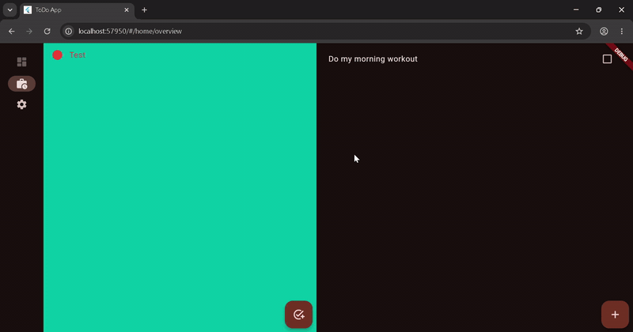
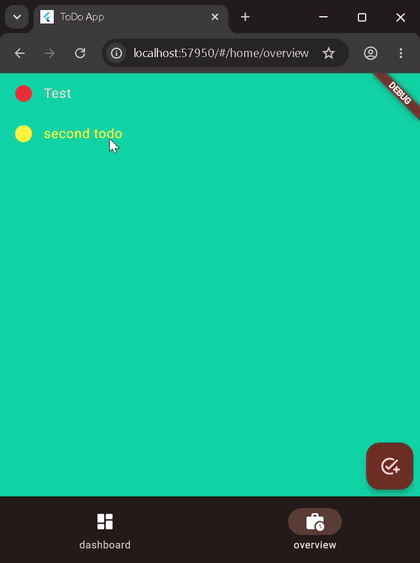

# todo_app

[](https://github.com/Romanahmad32/todo_app/actions/workflows/ci.yml)

A **responsive Flutter to-do app** that adapts its layout to the screen size (phone, tablet, desktop) using `flutter_adaptive_scaffold`. Built as a hands-on project to practice Clean Architecture and test-driven state management in Flutter.



**Same app, narrow screen** — the layout switches to a phone-style view:



## Features

- Organize todos in **collections**, each with its own color
- Create, edit and check off entries
- **Responsive UI** – bottom navigation on phones, navigation rail / two-pane layout on larger screens
- **Local persistence** with Hive (plus an in-memory mock data source for development)

## Architecture

Clean Architecture with three layers:

- **Domain:** entities (`TodoEntry`, `TodoCollection`), use cases, repository contracts — pure Dart, no Flutter dependencies
- **Data:** repository implementations, Hive local data source, JSON models (`json_serializable`)
- **Presentation:** BLoC/Cubit state management (`flutter_bloc`), navigation with `go_router`

Functional error handling with `dartz` (`Either<Failure, T>`) keeps failures explicit throughout the stack.

## Getting started

```bash
flutter pub get
flutter run
```

To run against the in-memory mock data source instead of Hive:

```bash
flutter run -t lib/main_mock.dart
```
